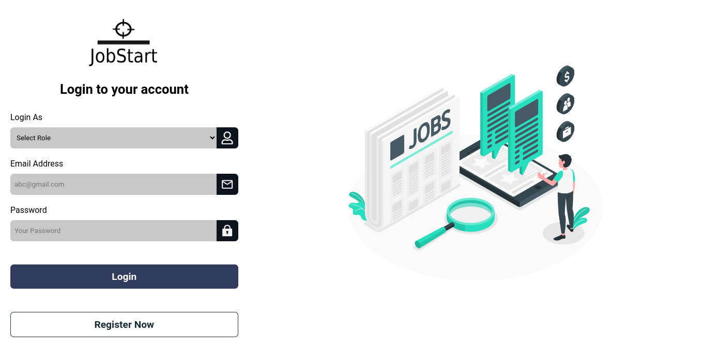
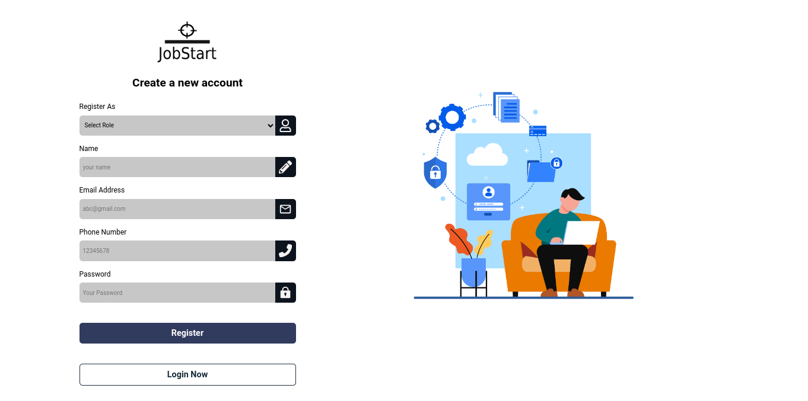
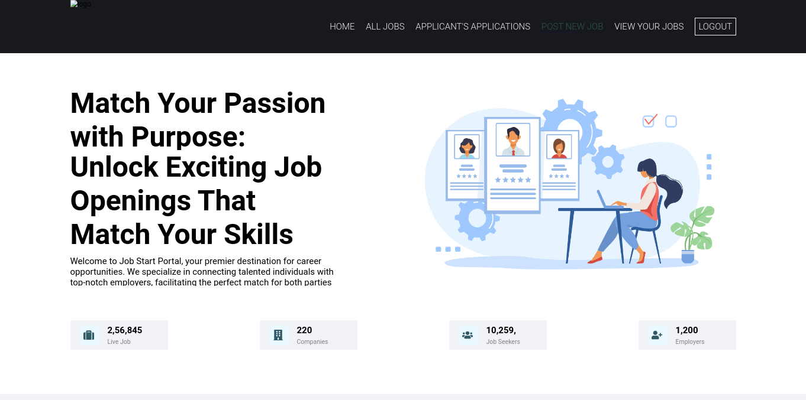
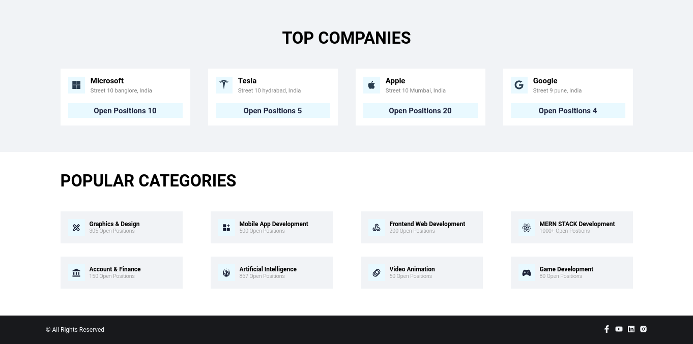
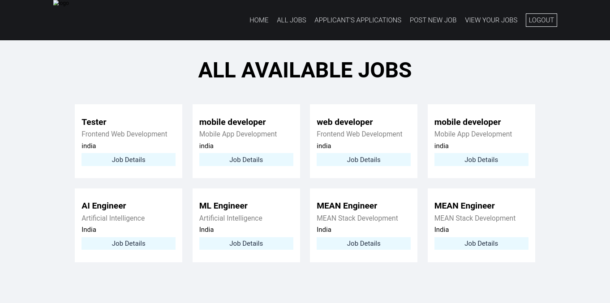
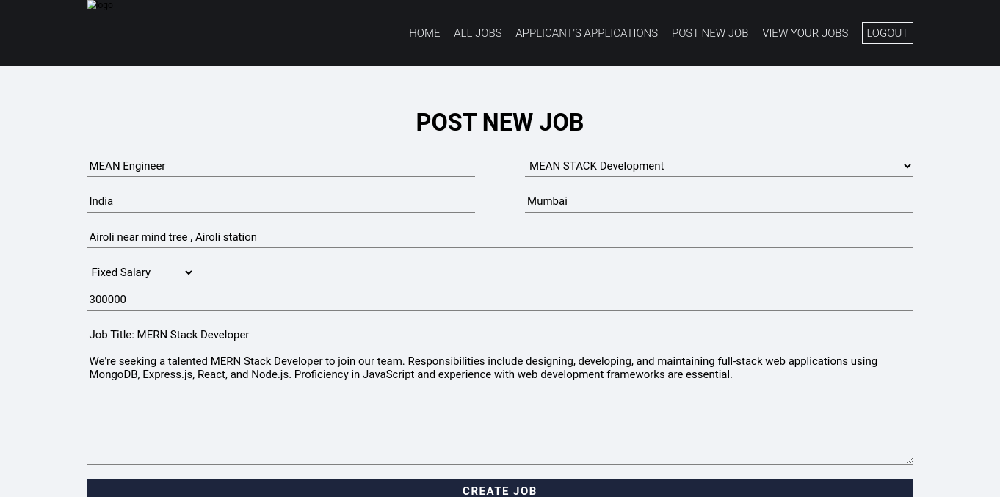
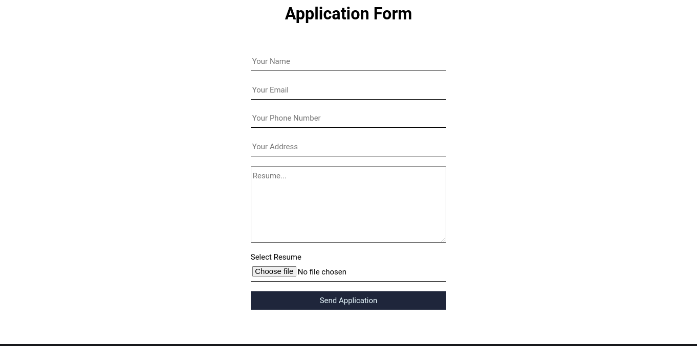
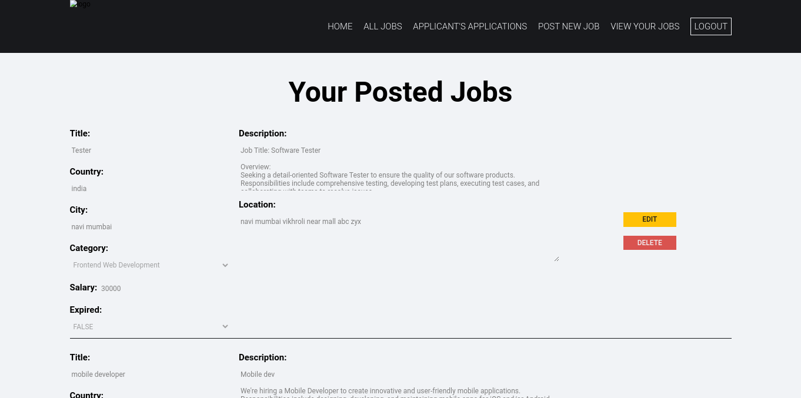
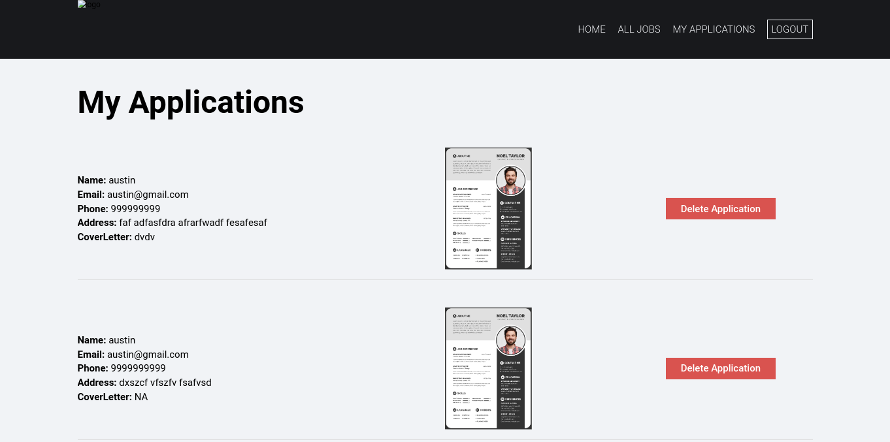
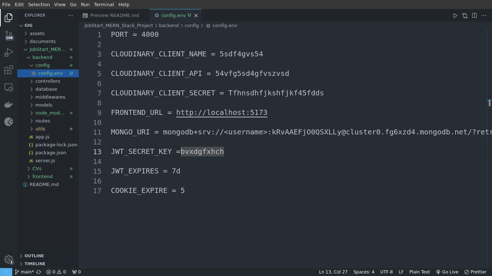

# Job Start - Job Portal Application

Welcome to Job Start, a job portal application designed to connect job seekers with potential employers. This MERN (MongoDB, Express.js, React.js, Node.js) full-stack project aims to provide a seamless experience for both job seekers and employers.

## Technologies Used
- MongoDB Atlas: Cloud-based NoSQL database
- Express.js: Backend framework for Node.js
- React.js: Frontend library for building user interfaces
- Node.js: JavaScript runtime environment
- Cloudinary: Backend cloud service to store resumes
- JWT (JSON Web Tokens): Used for user authentication

## Features

- **Job Listings:** Browse job listings posted by employers.
- **Resume Upload:** Job seekers can upload their resumes to their profiles.
- **User Authentication:** Secure login functionality using JWT.
- **Search Functionality:** Users can search for jobs based on various criteria.
- **Profile Management:** Users can update their profiles and manage their job applications.

## Installation Steps

1. **Clone the Repository:**
   ```
   git clone https://github.com/yourusername/job-start.git
   ```

2. **Install Dependencies:**
   ```
   cd job-start
   npm install
   ```

3. **Set Up Environment Variables:**
   Create a `.env` file in the root directory and add the following variables:
   ```
   PORT=3000
   MONGODB_URI=your_mongodb_uri
   CLOUDINARY_CLOUD_NAME=your_cloudinary_cloud_name
   CLOUDINARY_API_KEY=your_cloudinary_api_key
   CLOUDINARY_API_SECRET=your_cloudinary_api_secret
   JWT_SECRET=your_jwt_secret
   ```

4. **Run the Application:**
   ```
   npm start
   ```

5. **Open in Browser:**
   Navigate to `http://localhost:3000` to view the application.

## Screenshots

1. Login Page



2. Register page



3. Home page



4. Home 2




5. Available jobs



6. Post New Job



7. Resume Upload



8. Search job



9. Edit Profile



9. Config Settings (Edit as per your requirements)



Thank you for taking Time to Look at my project 🙏
